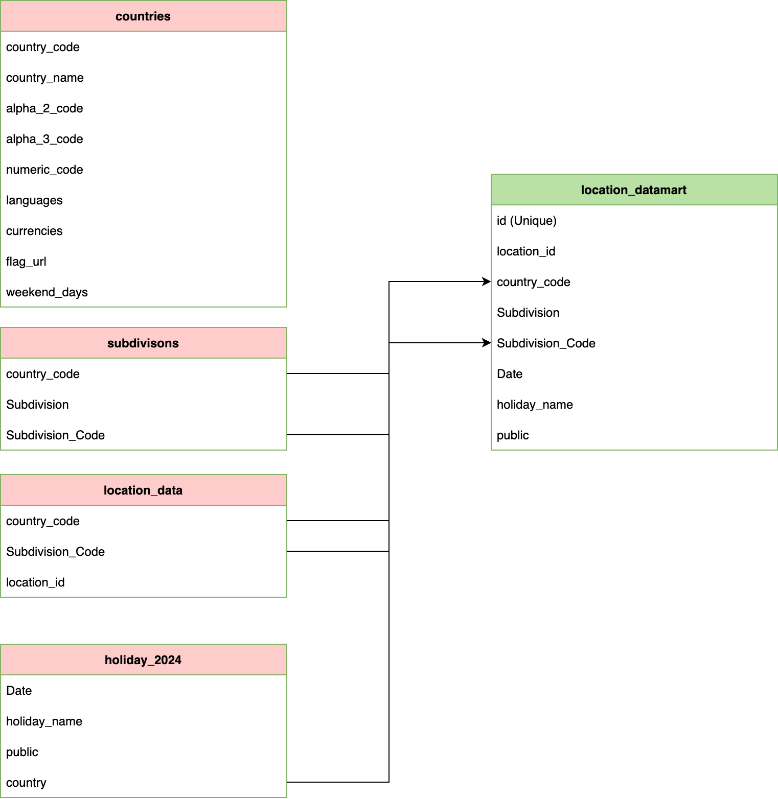

# Holidays and Location mapping

This project fetches countries and holidays data from the website: https://holidayapi.com/
It uses **Kestra** for orchestration and **PostgreSQL** for storage.  
Each Kestra flow is scheduled and automated.

## Features

- Ingests data into multiple tables using scheduled flows.
- `location_datamart` flow creates a final table that maps holidays to the specified locations.

## Installation

```bash
# Example:
git clone git@github.com:Speri1009/de_assignment.git
cd project
brew install colima
brew install docker docker-compose
colima start
docker-compose pull
docker-compose up
docker-compose down
```

Services:
Kestra: http://localhost:8080
pgadmin: http://localhost:8082

## Location_datamart

This table quickly give you holidays per location id for the last 1 year
Example

```
SELECT *
FROM public.locat_datamart
WHERE location_id = 'ab5df8c0-dfe7-4ca3-a9e4-c77f93e551a7'
```

## Architecture Diagram



## Future Scope for improvements

Use storage bucket where the kestra can find external files like subdivion codes, or location_data per country
User terraform for safer API and database connection
