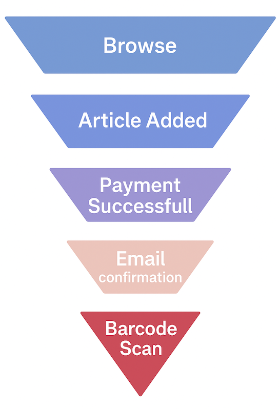

# Data Architecture: Funnel Event Tracking System

Customer funnel starts from when the customer reaches the landing page untill end of the journey

Browse = View

## 1. Overview

This architecture supports tracking user behavior through a funnel of interactions—from browsing to barcode scanning. The design is built on a layered data lakehouse model.

---

## 2. Funnel Events Tracked

- **View**
- **Article Added to Cart**
- **Payment Successful**
- **Email Confirmation**
- **Barcode Scanned**

Each stage generates one or more events captured through the backend and streamed/stored for processing.

---

## 3. Architecture Proposal

### 🔹 **Data Lake (Raw / Ingestion Layer)**

- Contains unprocessed event logs from backend sources
- Sources: App logs, APIs
- Format: JSON, Parquet or flattened tables with arrays
- Examples: `raw_event_logs`, `raw_clicks`, `raw_email_logs`

### 🔸 **Bronze Tables (Staging Layer)**

- Cleaned, normalized data with minimal transformations.
- Combines regions, platforms, formats.
- Partitioned by `event_date`, `platform`, etc.
- Examples: `bronze_events`, `bronze_clicks`,`bronze_views`, `bronze_sessions`, `bronze_users`

### 🪙 **Silver Tables (Business Logic Layer)**

- Deduplicated, joins, unions.
- Ready for reporting but still flexible.
- Examples: `silver_events`, `silver_sessions`, `silver_clicks`,`silver_views`,`silver_users`

### ⭐ **Gold Tables (Analytics / Data Marts)**

- Fact/dimension models for analytics
- Aggregated & formatted and in line with definitions.
- definitions to adhere to like unique user, unique session, unique event, different event types
- Examples:
  - `fact_user_activity`
  - `dim_user`
  - `fact_funnel_stage`
  - `mart_conversion_rate` -- Can analyize yearly,monthly, daily conversions
  - `mart_bacrcode_actiivity` -- Can analyize yearly,monthly, daily barcodescans

---

## 4. Core Tables and Logical Fields

All the tables can be partintion by partition date/ timestamp

### `User`

- `user_id`, `email`, `country`, `is_active`, `signup_date`

### `Session`

- `session_id`, `user_id`, `session_start_time`, `session_end_time`, `device_type`, `geo_location`

### `Click`

- `click_id`, `session_id`, `click_timestamp`, `element_clicked`, `page`

### `View`

- `view_id`, `session_id`, `view_timestamp`, `page_type`, `landing_page`, `is_referral`

### `Event`

- `event_id`, `event_type`(e.g. article added to cart), `session_id`, `timestamp`, `metadata`

### `Event_Response`

- `response_id`, `event_id`, `response_type`, `sent_email`,`sent_phone_number`, `status`

### `User_Activity`

- `activity_id`, `response_id`, `activity_type` (e.g. barcode scanned), `activity_time`

---

## 5. Data Quality & Refresh Logic

| Layer  | Refresh Strategy                | Notes                                                |
| ------ | ------------------------------- | ---------------------------------------------------- |
| Raw    | Streaming / Batch Append        | Immutable, used for reprocessing                     |
| Bronze | Incremental-overwrite/ Backfill | Supports deduplication, schema changes               |
| Silver | Incremental-overwrite           | Business logic + late-arrival handling               |
| Gold   | Truncate & Load                 | latest Snapshot,full aggregation daily,Full Snapshot |

---

## 6. Use Cases Sample

- **Funnel analysis**
  Analyze the bounce rates per event stage
- **Conversion Rates**
  How many views converted to adding article to cart
  How many article to cart events converted to payment success
  How many success barecode scans
- **Retargeting**
  When to target an inactive customer
  Which customer segment should recive which type of campaigns
- **A/B testing**
  Newly launched payment method vrs old payment method
- **Operational alerts**
  Notifications about abandoned cart
  Promotions

---

## 7. Tools & Tech Stack

- **Ingestion**: Airflow, Kestra
- **Infrastructure**: Terraform
- **Storage**: AWS S3 / GCS
- **Processing**: dbt, Airflow
- **Warehouse**: BigQuery / Snowflake / Redshift
- **BI**: Looker, Tableau, Power BI

---
